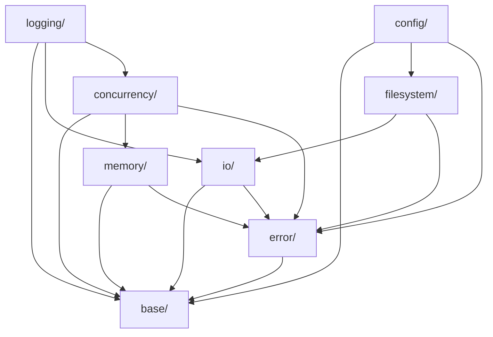

# Core Layer Architecture – AGENT.md

## Executive Summary

The `core/` layer provides **foundational, domain-agnostic** infrastructure for modern C++ applications. This library is completely independent and self-contained, designed for use in any C++ project requiring robust infrastructure patterns.

### Current State Assessment
- **Implemented**: `base/` (90%), `logging/` (headers only), `config/` (partial)
- **Planned**: 13 additional modules with detailed specifications
- **Architecture**: Standalone library with no dependencies on numeric or domain-specific code
- **External Dependencies**: fmt library (bundled), standard library only

### Architectural Independence
**CRITICAL**: The core library and numeric library (`src/numeric/`) are **completely independent siblings**:
- Neither library depends on the other
- Each has its own error handling, memory management, and design patterns
- Future application layers may use both libraries independently
- No shared base classes or infrastructure between libraries

### What Core Library IS
- A standalone, domain-agnostic infrastructure library
- Reusable patterns for ANY C++ application (web servers, games, tools, etc.)
- Generic facilities: logging, configuration, threading, I/O
- Self-contained with no knowledge of numerical computing

### What Core Library IS NOT
- NOT a foundation layer for the numeric library
- NOT providing base classes for matrices/vectors
- NOT defining error handling for numerical operations
- NOT managing memory for numerical algorithms
- NOT orchestrating parallel numerical computations

---

## Architecture Overview

### Design Principles
1. **Zero-cost abstractions** – Template metaprogramming, compile-time optimization
2. **Cache-conscious design** – Data locality, minimal indirection
3. **Modern C++20** – Concepts, ranges, coroutines where beneficial
4. **Thread-safe by default** – Lock-free where possible, clear ownership
5. **Header-only options** – Minimize compilation dependencies

### Module Hierarchy

```
core/
├── base/            # Foundation (IMPLEMENTED)
├── error/           # Error handling (CRITICAL - Priority 1)
├── memory/          # Memory management (CRITICAL - Priority 1)
├── concurrency/     # Threading & async (ESSENTIAL - Priority 2)
├── io/              # I/O abstractions (ESSENTIAL - Priority 2)
├── filesystem/      # File operations (ESSENTIAL - Priority 2)
├── logging/         # Logging (IMPLEMENTED - needs .cpp)
├── config/          # Configuration (PARTIAL - needs completion)
├── serialization/   # Data persistence (IMPORTANT - Priority 3)
├── events/          # Event system (IMPORTANT - Priority 3)
├── metrics/         # Performance monitoring (OPTIONAL - Priority 4)
├── tracing/         # Profiling support (OPTIONAL - Priority 4)
├── reflection/      # Type introspection (OPTIONAL - Priority 4)
├── plugins/         # Dynamic loading (OPTIONAL - Priority 4)
└── workflow/        # Task orchestration (OPTIONAL - Priority 4)
```

### Dependency Rules



---

## Module Specifications

### `base/` – Core Infrastructure Patterns ✅ IMPLEMENTED

**Current Implementation:**
```cpp
object.h/cpp        // Intrusive ref-counting base class
factory.h/cpp       // Generic factory with thread-safe registration
registry.h/cpp      // Type-safe object registry
observer.h/cpp      // Subject-observer pattern
component.h/cpp     // Entity-component system
singleton.h/cpp     // Thread-safe singleton
visitor.h/cpp       // Visitor pattern
policy.h/cpp        // CRTP policy classes
interface.h/cpp     // Pure interface base
```

**Key Features:**
- Intrusive reference counting with `object_ptr<T>` smart pointer
- Thread-safe factory with parameterized construction
- Modern C++20 concepts (`ObjectDerived`)
- Source location tracking for debugging
- Integrated with `fem::config` for compile-time configuration

**Domain-Agnostic Use Cases:**
- Web servers requiring reference-counted resources
- Game engines needing entity-component systems
- CAD applications using factory patterns for shapes
- Generic plugin systems with dynamic object creation

### `error/` – Modern Error Handling 🔴 NOT IMPLEMENTED (Priority 1)

**Proposed Implementation:**
```cpp
result.h            // Result<T,E> type (like Rust/C++23 expected)
error_code.h        // Lightweight error codes
error_category.h    // Error categorization system
error_handler.h     // Global error handling policies
panic.h             // Panic/abort mechanisms
backtrace.h         // Stack trace capture (optional)
```

**Design Decisions:**
- Use `std::expected<T,E>` when C++23 available, custom implementation for C++20
- Lightweight error codes over exceptions for performance
- Support both recoverable and panic scenarios
- Integration with logging for error tracking

**Example Usage:**
```cpp
// Domain-agnostic example: loading configuration
Result<Config, ErrorCode> load_config(const Path& file) {
    if (!file.exists()) 
        return Error{ErrorCode::FileNotFound};
    // ...
    return Config{data};
}

// Note: The numeric library has its own error handling patterns,
// completely independent of core::Result<T,E>
```

### `memory/` – Advanced Memory Management 🔴 NOT IMPLEMENTED (Priority 1)

**Proposed Implementation:**
```cpp
// Allocators
allocator_traits.h   // C++20 allocator concepts
arena_allocator.h    // Linear arena allocation
pool_allocator.h     // Fixed-size object pools
stack_allocator.h    // Stack-based allocation

// Containers  
small_vector.h       // SSO vector (like LLVM SmallVector)
stable_vector.h      // Pointer-stable vector
ring_buffer.h        // Lock-free ring buffer

// Utilities
memory_resource.h    // Polymorphic allocator support
aligned_storage.h    // Cache-line alignment utilities
```

**Design Focus:**
- Cache-friendly data structures
- NUMA-aware allocation strategies
- Generic container support (not specific to numeric)
- Zero-overhead when not used

**Note**: The numeric library maintains its own specialized memory management for matrices and vectors, independent of core allocators

### `concurrency/` – Modern Threading Support 🔴 NOT IMPLEMENTED (Priority 2)

**Proposed Implementation:**
```cpp
// Core Threading
thread_pool.h        // Work-stealing thread pool
task.h               // Task abstraction
future.h             // Enhanced futures with continuations

// Synchronization
spinlock.h           // Lightweight spinlock
rw_lock.h            // Reader-writer lock
latch.h              // C++20 latch/barrier

// Parallel Algorithms
parallel_for.h       // Parallel iteration
parallel_reduce.h    // Parallel reduction
pipeline.h           // Pipeline parallelism

// Coroutines (C++20)
async_generator.h    // Async iteration
task_queue.h         // Coroutine-based task queue
```

**Domain-Agnostic Applications:**
- Parallel data processing pipelines
- Async I/O operations for servers
- Task-based game engine systems
- Concurrent build systems

**Note**: The numeric library has its own parallelization strategies (OpenMP, TBB, etc.) independent of core concurrency

### `io/` – Stream Abstractions 🔴 NOT IMPLEMENTED (Priority 2)

**Proposed Implementation:**
```cpp
stream_base.h        // Abstract stream interface
buffered_stream.h    // Buffered I/O
memory_stream.h      // In-memory streams
file_stream.h        // File I/O streams
async_stream.h       // Async I/O support
format_stream.h      // Formatted output (fmt integration)
```

### `filesystem/` – File System Operations 🔴 NOT IMPLEMENTED (Priority 2)

**Proposed Implementation:**
```cpp
path.h               // Path manipulation (beyond std::filesystem)
file_watcher.h       // File system monitoring
resource_manager.h   // Resource loading/caching
temp_file.h          // Temporary file management
memory_mapped.h      // Memory-mapped files
```

### `logging/` – Structured Logging ⚠️  HEADERS ONLY

**Current State:**
- Headers implemented with comprehensive async logging design
- Missing: Actual implementation (.cpp files)
- Includes: AsyncLogger, LogBuffer, LogContext, LogFilter, LogFormatter

**Required Work:**
1. Implement source files for all headers
2. Add fmt library integration
3. Create default sinks (console, file, syslog)
4. Add structured logging support (JSON output)

### `config/` – Configuration Management ⚠️  PARTIAL

**Current State:**
- `config.h` - Compile-time configuration ✅
- `debug.h` - Debug macros ✅
- `config_manager.h` - Runtime config (header only) ⚠️

**Required Work:**
1. Implement ConfigManager source file
2. Add YAML/JSON parser integration
3. Environment variable support
4. Hot-reload capability
5. Schema validation

### Remaining Modules (Lower Priority)

**`serialization/`** – Data Persistence (Priority 3)
- Binary/JSON/MessagePack formats
- Schema evolution support
- Integration with reflection system

**`events/`** – Event System (Priority 3)  
- Type-safe event bus
- Signal/slot mechanism
- Event queuing and prioritization

**`metrics/`** – Performance Monitoring (Priority 4)
- Counters, gauges, histograms
- Prometheus-compatible export
- Zero-overhead when disabled

**`tracing/`** – Profiling Support (Priority 4)
- Chrome tracing format
- Flame graph generation
- Integration with Tracy/Intel VTune

**`reflection/`** – Type Introspection (Priority 4)
- Runtime type information
- Property/method enumeration
- Requires C++ reflection TS or custom macros

**`plugins/`** – Dynamic Loading (Priority 4)
- Cross-platform .so/.dll loading
- Version compatibility checking
- Hot-reload support

**`workflow/`** – Task Orchestration (Priority 4)
- Command pattern with undo/redo
- State machine framework
- DAG-based task scheduling

---

## Library Independence & Architecture

### Namespace Structure
```cpp
fem::core::          // Core infrastructure (standalone)
fem::numeric::       // Numeric library (standalone)
fem::solver::        // FEM solvers (future - may use both)
fem::application::   // Application layer (future - may use both)
```

### Architectural Separation

**The core and numeric libraries are INDEPENDENT:**

1. **Separate Error Handling**
   ```cpp
   // Core library uses its own Result type
   fem::core::Result<Config> load_config(const Path& file);
   
   // Numeric library has its own error patterns
   // (return codes, exceptions, or its own Result type)
   int fem::numeric::Matrix::factorize(); // Returns error code
   ```

2. **Separate Memory Management**
   ```cpp
   // Core has generic allocators
   fem::core::memory::ArenaAllocator arena;
   
   // Numeric has specialized matrix/vector allocators
   fem::numeric::AlignedAllocator<double> matrix_alloc;
   ```

3. **Separate Base Classes**
   ```cpp
   // Core objects
   class Component : public fem::core::Object { };
   
   // Numeric has its own hierarchy
   class Matrix : public fem::numeric::NumericBase { };
   ```

4. **Future Application Layer Integration**
   ```cpp
   // Only at the application level might both be used
   namespace fem::application {
       // Adapter to use both libraries together
       class SolverAdapter {
           fem::core::ThreadPool pool;           // From core
           fem::numeric::SparsMatrix matrix;     // From numeric
       };
   }
   ```

---

## C++20/23 Feature Utilization

### Currently Used
- **Concepts** - Type constraints in base/ for generic programming
- **Source Location** - Debug tracking without macros
- **Three-way comparison** - Simplified comparisons
- **Designated initializers** - Clear configuration
- **Template syntax improvements** - Cleaner template code

### Opportunities for Enhancement

1. **Coroutines** (C++20)
   ```cpp
   // Async file I/O
   Task<Buffer> read_file_async(const Path& path) {
       auto handle = co_await open_async(path);
       co_return co_await read_all_async(handle);
   }
   ```

2. **Ranges** (C++20)
   ```cpp
   // Pipeline operations
   auto results = data 
       | std::views::filter(is_valid)
       | std::views::transform(process)
       | std::ranges::to<std::vector>();
   ```

3. **Modules** (C++20/23)
   ```cpp
   export module fem.core;
   export import fem.core.base;
   export import fem.core.memory;
   // Faster compilation, better encapsulation
   ```

4. **std::expected** (C++23)
   ```cpp
   // Native error handling
   std::expected<Vector, ErrorCode> result = compute();
   ```

---

## Build System Improvements

### CMake Modernization
```cmake
# Use target-based approach
add_library(fem_core INTERFACE)
target_sources(fem_core INTERFACE
    FILE_SET HEADERS
    BASE_DIRS include
    FILES ${HEADER_FILES}
)

# Feature flags
target_compile_definitions(fem_core INTERFACE
    $<$<CONFIG:Debug>:FEM_DEBUG>
    $<$<BOOL:${ENABLE_TRACING}>:FEM_ENABLE_TRACING>
)

# Precompiled headers
target_precompile_headers(fem_core INTERFACE
    <concepts>
    <memory>
    <string_view>
)
```

### Dependency Management
- **fmt**: Keep bundled, it's lightweight and stable
- **GoogleTest**: Already integrated for testing
- **Future considerations**: 
  - spdlog for advanced logging
  - Tracy for profiling
  - simdjson for JSON parsing

---

## Implementation Roadmap

### 🔴 Phase 1: Critical Foundation (Week 1-2)
1. **error/** - Implement Result<T,E> and error handling
2. **memory/** - Core allocators and containers
3. Complete **logging/** implementation (.cpp files)
4. Complete **config/** implementation

### 🟡 Phase 2: Essential Infrastructure (Week 3-4)
5. **concurrency/** - Thread pool and parallel algorithms
6. **io/** - Stream abstractions
7. **filesystem/** - Enhanced file operations
8. Core library integration tests (no numeric dependency)

### 🟢 Phase 3: Enhanced Features (Week 5-6)
9. **serialization/** - Binary/JSON support for generic data
10. **events/** - Event bus implementation for generic systems
11. Performance benchmarks (core library only)
12. Documentation generation (core library standalone docs)

### 🔵 Phase 4: Optional Advanced (As Needed)
13. **metrics/** - If monitoring needed
14. **tracing/** - If profiling needed
15. **reflection/** - If serialization requires
16. **plugins/** - If dynamic loading needed
17. **workflow/** - If complex orchestration needed

---

## Critical Gaps & Recommendations

### 🔴 Critical Issues for Core Library

1. **No Error Handling Infrastructure**
   - Core library needs consistent error strategy for its own operations
   - Result<T,E> pattern for domain-agnostic error propagation
   - **Action**: Implement `error/` module for core library use
   - **Note**: Numeric library maintains its own independent error handling

2. **Memory Management Gaps**
   - No generic allocators for core data structures
   - Missing arena allocation for core temporaries
   - **Action**: Implement `memory/` with generic allocators
   - **Note**: Numeric library has specialized allocators for matrices/vectors

3. **Threading Not Abstracted**
   - No generic thread pool for core operations
   - Missing async primitives for I/O and events
   - **Action**: Implement `concurrency/` for core infrastructure
   - **Note**: Numeric library uses OpenMP/TBB independently

### ⚠️  Important Issues

4. **Incomplete Logging**
   - Headers without implementation
   - No performance impact measurements
   - **Action**: Complete implementation, add compile-time disable

5. **Configuration Half-Done**
   - Runtime config manager not implemented
   - No schema validation
   - **Action**: Finish implementation with YAML support

### 🟡 Recommendations

1. **Simplify Module Count**
   - Consider merging `metrics/` and `tracing/` into `diagnostics/`
   - Merge `workflow/` patterns into `base/`
   - Focus on core 8-10 modules instead of 16

2. **Standardize Core Library Error Strategy**
   ```cpp
   // Use Result<T,E> within core library only
   namespace fem::core {
       template<typename T>
       using Result = std::expected<T, ErrorCode>; // C++23
       // or custom implementation for C++20
   }
   // Note: This does NOT apply to numeric library,
   // which has its own error handling patterns
   ```

3. **Header-Only Where Possible**
   - Make `error/`, `memory/` header-only
   - Reduces compilation dependencies
   - Easier integration

4. **Benchmark Everything**
   - Add microbenchmarks for each module
   - Measure compile-time impact
   - Profile memory usage

---

## Summary

The core library architecture is well-conceived as a **standalone, domain-agnostic infrastructure library**. Priority should be:

1. **Error handling** - Consistent error propagation for core operations
2. **Memory management** - Generic allocators for core data structures
3. **Concurrency** - Thread pools and async primitives for core
4. **Complete existing** - Logging and config modules

**Critical Understanding**: 
- The core library does NOT provide infrastructure for the numeric library
- The numeric library is completely independent with its own patterns
- Both libraries are self-contained and can be used separately
- Future application layers may choose to use both libraries independently

The architecture maintains complete separation between core infrastructure and domain-specific numeric computations, ensuring both libraries remain reusable and maintainable.

**Next Steps:**
1. Implement `error/` module (2-3 days)
2. Implement core `memory/` components (3-4 days)
3. Complete `logging/` and `config/` (2 days)
4. Create integration tests (2 days)
5. Benchmark and optimize (ongoing)